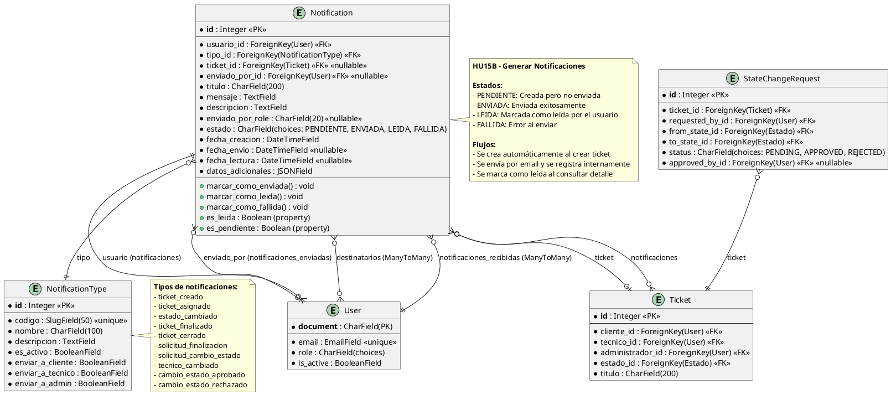

# HU15B - Generar Notificaciones

## Información de la Historia de Usuario

[Tabla: Información de la Historia de Usuario - Ver sección de tablas en el chat]

---

## Modelo de Datos (PlantUML)

## Diagrama de Clases (PlantUML)

```plantuml
@startuml HU15B_Diagrama_Clases

!define MODEL_COLOR #E6F3FF
!define SERVICE_COLOR #FFE6E6
!define VIEW_COLOR #E6FFE6
!define SERIALIZER_COLOR #FFF4E6
!define SIGNAL_COLOR #F0E6FF

package "notifications.models" MODEL_COLOR {
  class Notification <<Model>> {
    +usuario: ForeignKey(User)
    +destinatarios: ManyToMany(User)
    +ticket: ForeignKey(Ticket)
    +tipo: ForeignKey(NotificationType)
    +titulo: CharField
    +mensaje: TextField
    +estado: CharField(choices)
    +fecha_creacion: DateTimeField
    +fecha_envio: DateTimeField
    +fecha_lectura: DateTimeField
    +datos_adicionales: JSONField
    --
    +marcar_como_enviada(): void
    +marcar_como_leida(): void
    +marcar_como_fallida(): void
    +es_leida: Boolean (property)
    +es_pendiente: Boolean (property)
  }
  
  class NotificationType <<Model>> {
    +codigo: SlugField
    +nombre: CharField
    +descripcion: TextField
    +es_activo: BooleanField
    +enviar_a_cliente: BooleanField
    +enviar_a_tecnico: BooleanField
    +enviar_a_admin: BooleanField
  }
}

package "notifications.services" SERVICE_COLOR {
  class NotificationService <<Service>> {
    {static} +enviar_notificacion_ticket_creado(ticket): Dict
    {static} +enviar_notificacion_estado_cambiado(ticket, estado_anterior): Dict
    {static} +enviar_solicitud_finalizacion(ticket): Dict
    {static} +enviar_ticket_finalizado(ticket): Dict
    {static} +enviar_solicitud_cambio_estado(state_request): Dict
    {static} +enviar_aprobacion_cambio_estado(state_request): Dict
    {static} +enviar_rechazo_cambio_estado(state_request): Dict
    {static} +enviar_ticket_cerrado(ticket, state_request): Dict
    {static} +enviar_tecnico_cambiado(ticket, tecnico_anterior): Dict
    {private} +_enviar_notificacion_cliente(...): void
    {private} +_enviar_notificacion_tecnico(...): void
    {private} +_enviar_notificacion_admin(...): void
    {private} +_enviar_notificacion_completa(...): void
    {private} +_crear_notificacion_interna(...): void
    {private} +_enviar_email(...): void
    {private} +_validar_usuario_para_notificacion(usuario): Boolean
  }
}

package "notifications.views" VIEW_COLOR {
  class notification_list <<View>> {
    +GET /notifications/
    +permission_classes: [IsAuthenticated]
    +Filtra por usuario autenticado
    +Filtros: estado, tipo, leidas
    +Paginación: limit, offset
  }
  
  class notification_detail <<View>> {
    +GET /notifications/<id>/
    +permission_classes: [IsAuthenticated]
    +Valida acceso: usuario o admin
    +Marca como leída automáticamente
  }
  
  class UserNotificationsAV <<View>> {
    +GET /notifications/user-notifications/
    +permission_classes: [IsAuthenticated]
    +Retorna historial del usuario
    +Filtros y paginación
  }
  
  class NotificationMarkAsReadAV <<View>> {
    +PUT /notifications/<id>/mark-read/
    +permission_classes: [IsAuthenticated]
    +Marca notificación como leída
  }
}

package "notifications.serializers" SERIALIZER_COLOR {
  class NotificationSerializer <<Serializer>> {
    +tipo_nombre: CharField (read_only)
    +tipo_codigo: CharField (read_only)
    +usuario: SerializerMethodField
    +enviado_por: SerializerMethodField
    +destinatarios: SerializerMethodField
    +mensaje: SerializerMethodField
  }
  
  class NotificationListSerializer <<Serializer>> {
    +Campos simplificados para listado
    +Incluye información básica
  }
  
  class NotificationUpdateSerializer <<Serializer>> {
    +estado: CharField
    +update(): Notification
  }
}

package "notifications.signals" SIGNAL_COLOR {
  class ticket_created_notification <<Signal>> {
    +@receiver(post_save, sender=Ticket)
    +Se ejecuta al crear ticket
    +Llama a NotificationService.enviar_notificacion_ticket_creado()
  }
  
  class ticket_state_change_notification <<Signal>> {
    +@receiver(pre_save, sender=Ticket)
    +Detecta cambio de estado
    +Llama a NotificationService.enviar_notificacion_estado_cambiado()
  }
  
  class ticket_technician_change_notification <<Signal>> {
    +@receiver(pre_save, sender=Ticket)
    +Guarda técnico anterior
  }
  
  class ticket_technician_changed_post_save <<Signal>> {
    +@receiver(post_save, sender=Ticket)
    +Detecta cambio de técnico
    +Llama a NotificationService.enviar_tecnico_cambiado()
  }
}

' Relaciones
NotificationService ..> Notification : crea
NotificationService ..> NotificationType : crea/obtiene
NotificationService ..> Ticket : consulta
NotificationService ..> User : consulta
NotificationService ..> EmailMultiAlternatives : envía

notification_list ..> NotificationSerializer : usa
notification_detail ..> NotificationSerializer : usa
UserNotificationsAV ..> NotificationSerializer : usa
NotificationMarkAsReadAV ..> NotificationUpdateSerializer : usa

ticket_created_notification ..> NotificationService : llama
ticket_state_change_notification ..> NotificationService : llama
ticket_technician_changed_post_save ..> NotificationService : llama

note right of NotificationService
  **Servicio Principal**
  
  **Métodos públicos:**
  - Envío automático por eventos
  - Retorna Dict con resultados
  - Maneja errores y logging
  
  **Flujos:**
  - Crea notificación interna
  - Envía email (asíncrono)
  - Registra resultados
end note

note right of ticket_created_notification
  **Escenario 1 y 2:**
  Al crear ticket, se envía
  notificación a cliente y técnico
  automáticamente
end note

note right of ticket_state_change_notification
  **Escenario 4:**
  Al cambiar estado, se notifica
  al cliente automáticamente
end note

@enduml
```

## Descripción de Entidades

### Entidad: Notification

**Atributos:**
- `id` (Integer, PK): Identificador único de la notificación
- `usuario` (ForeignKey(User)): Usuario destinatario principal de la notificación
- `destinatarios` (ManyToMany(User)): Lista de usuarios destinatarios adicionales
- `ticket` (ForeignKey(Ticket), nullable): Ticket relacionado con la notificación
- `tipo` (ForeignKey(NotificationType)): Tipo de notificación
- `titulo` (CharField, max_length=200): Título de la notificación
- `mensaje` (TextField): Mensaje principal de la notificación
- `descripcion` (TextField): Descripción adicional opcional
- `enviado_por` (ForeignKey(User), nullable): Usuario que envió la notificación
- `enviado_por_role` (CharField, max_length=20, nullable): Rol del emisor
- `estado` (CharField, choices): Estado de la notificación (PENDIENTE, ENVIADA, LEIDA, FALLIDA)
- `fecha_creacion` (DateTimeField): Fecha y hora de creación
- `fecha_envio` (DateTimeField, nullable): Fecha y hora de envío
- `fecha_lectura` (DateTimeField, nullable): Fecha y hora de lectura
- `datos_adicionales` (JSONField): Información adicional en formato JSON

**Métodos:**
- `marcar_como_enviada()`: Cambia el estado a ENVIADA y actualiza fecha_envio
- `marcar_como_leida()`: Cambia el estado a LEIDA y actualiza fecha_lectura
- `marcar_como_fallida()`: Cambia el estado a FALLIDA
- `es_leida` (property): Retorna True si el estado es LEIDA
- `es_pendiente` (property): Retorna True si el estado es PENDIENTE

**Relaciones:**
- Muchos a uno con `User` como `usuario` (destinatario principal)
- Muchos a muchos con `User` como `destinatarios` (destinatarios adicionales)
- Muchos a uno con `User` como `enviado_por` (emisor)
- Muchos a uno con `Ticket` (ticket relacionado)
- Muchos a uno con `NotificationType` (tipo de notificación)

---

### Entidad: NotificationType

**Atributos:**
- `id` (Integer, PK): Identificador único del tipo
- `codigo` (SlugField, max_length=50, unique): Código único del tipo (ej: 'ticket_creado')
- `nombre` (CharField, max_length=100): Nombre descriptivo del tipo
- `descripcion` (TextField): Descripción del tipo de notificación
- `es_activo` (BooleanField): Indica si el tipo está activo
- `enviar_a_cliente` (BooleanField): Indica si se envía a clientes
- `enviar_a_tecnico` (BooleanField): Indica si se envía a técnicos
- `enviar_a_admin` (BooleanField): Indica si se envía a administradores

**Relaciones:**
- Uno a muchos con `Notification` (notificaciones de este tipo)

---

## 5.4. Diseño de Lógica de Negocio

**Algoritmos Clave:**

1. **Algoritmo de Notificación Automática al Crear Ticket**: Al crear un ticket (signal `post_save`), se ejecuta automáticamente el servicio que envía notificaciones al cliente y al técnico asignado. Crea notificaciones internas en la base de datos y envía emails de forma asíncrona (Escenario 1, 2 y 3).

2. **Algoritmo de Notificación de Cambio de Estado**: Al detectar cambio de estado en un ticket (signal `pre_save`), compara el estado anterior con el nuevo y envía notificación al cliente informando el cambio. Si el nuevo estado es "finalizado", envía notificaciones adicionales (Escenario 4).

3. **Algoritmo de Notificación de Solicitud de Finalización**: Cuando el técnico solicita cambiar el estado a "finalizado", se crea una StateChangeRequest y se envían notificaciones a todos los administradores activos informando de la solicitud (Escenario 5).

4. **Algoritmo de Notificación de Ticket Cerrado**: Cuando el administrador aprueba el estado "finalizado", se envían notificaciones tanto al cliente como al técnico confirmando el cierre del ticket (Escenario 6).

5. **Algoritmo de Notificación de Cambio de Técnico**: Al modificar el técnico asignado a un ticket, se detecta el cambio mediante signals y se envían notificaciones tanto al técnico anterior (desasignado) como al nuevo técnico (asignado) (Escenario 7).

6. **Algoritmo de Validación de Acceso a Notificaciones**: Al consultar el historial de notificaciones, valida que el usuario esté autenticado y filtra solo las notificaciones donde el usuario es destinatario principal. Si el usuario no está autenticado, retorna error de acceso (Escenario 8, 9 y 10).

7. **Algoritmo de Envío Dual (Email + Interna)**: Para cada notificación, se crea un registro interno en la base de datos y se envía un email de forma asíncrona. El email se envía en un thread separado para no bloquear la respuesta. Si falla el email HTML, se intenta fallback a texto plano.

8. **Algoritmo de Validación de Usuario**: Antes de enviar una notificación, valida que el usuario tenga email válido, esté activo y exista en la base de datos. Si alguna validación falla, registra el error pero no interrumpe el flujo principal.

**Servicios/Clases Principales**

**Diagrama de clases** (ver diagrama PlantUML anterior)

[Tabla: Servicios/Clases Principales - Ver sección de tablas en el chat]

---

## 5.5. Diseño de Integración

**Puntos de Integración**

[Tabla: Puntos de Integración - Ver sección de tablas en el chat]

---

## Criterios de Aceptación

[Tabla: Criterios de Aceptación - Ver sección de tablas en el chat]

---

## Definición de "Terminado"

Para considerar la HU15B como "Terminado", se deben cumplir los siguientes criterios basados en los escenarios de aceptación:

### Criterios Funcionales

1. **Notificación al crear ticket (Escenario 1, 2 y 3)**: 
   - Los endpoints de creación de tickets deben generar automáticamente notificaciones al cliente y al técnico asignado.
   - Las notificaciones deben registrarse correctamente en la base de datos.
   - Se deben devolver códigos de estado HTTP adecuados (201 para creación exitosa).

2. **Notificación de cambio de estado (Escenario 4)**:
   - Cuando el técnico cambia el estado de un ticket, el sistema debe enviar automáticamente una notificación al cliente.
   - La notificación debe incluir información del estado anterior y nuevo.

3. **Notificación de solicitud de finalización (Escenario 5)**:
   - Cuando el técnico solicita cambiar el estado a "finalizado", el sistema debe enviar notificaciones a todos los administradores activos.
   - La solicitud debe registrarse en StateChangeRequest.

4. **Notificación de ticket cerrado (Escenario 6)**:
   - Cuando el administrador aprueba el estado "finalizado", el sistema debe enviar notificaciones tanto al cliente como al técnico.
   - Las notificaciones deben confirmar el cierre del ticket.

5. **Notificación de cambio de técnico (Escenario 7)**:
   - Cuando el administrador modifica el técnico asignado, el sistema debe enviar notificaciones al técnico anterior y al nuevo técnico.

6. **Consulta de historial de notificaciones (Escenario 8)**:
   - El endpoint de historial debe listar correctamente las notificaciones del usuario autenticado.
   - Debe filtrar automáticamente por el ID del usuario autenticado.
   - Debe retornar código de estado HTTP 200 con la lista de notificaciones.

7. **Validación de acceso (Escenario 9 y 10)**:
   - Los endpoints deben validar que el usuario esté autenticado.
   - Si el usuario no está autenticado, debe retornar código 401 con mensaje "No tiene acceso".
   - Si el usuario intenta acceder a notificaciones de otro usuario, debe retornar código 403 con mensaje "No tienes permiso para acceder".

### Criterios Técnicos

1. **Validaciones**:
   - Los endpoints correspondientes deben manejar las validaciones correctamente (usuario autenticado, permisos, existencia de recursos).
   - Se deben validar que los usuarios destinatarios existan y estén activos antes de enviar notificaciones.

2. **Códigos de estado HTTP**:
   - Se deben devolver los códigos de estado HTTP adecuados:
     - 200 para consultas exitosas
     - 201 para creación exitosa
     - 400 para errores de validación
     - 401 para no autenticado
     - 403 para no autorizado
     - 404 para recurso no encontrado

3. **Interacción con base de datos**:
   - El sistema debe interactuar correctamente con la base de datos para registrar, verificar y actualizar el estado de las notificaciones.
   - Las notificaciones deben persistirse correctamente con todos sus campos.
   - Las consultas deben filtrar correctamente por usuario autenticado.

4. **Envío de emails**:
   - El sistema debe enviar emails de forma asíncrona sin bloquear la respuesta HTTP.
   - Debe manejar errores de envío de email sin interrumpir el registro de notificación interna.
   - Debe implementar fallback a texto plano si falla el envío HTML.

5. **Signals y automatización**:
   - Los signals de Django deben ejecutarse correctamente al crear o modificar tickets.
   - Las notificaciones deben generarse automáticamente sin intervención manual.

